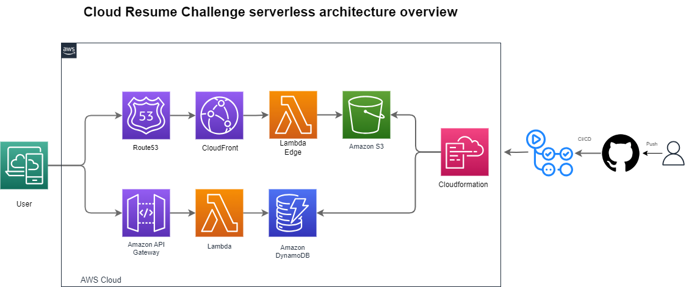

# Cloud-resume-Challenge-AWS 

This is my attempt at cloud resume challenge in AWS. What is Cloud Resume Challenge? - The Cloud Resume Challenge is a multiple-step resume project which helps build and demonstrate skills fundamental to pursuing a career in Cloud. The project was published by Forrest Brazeal.

## Challenges:

- [x] Get a Cloud Cert.
- [x] Create a GitHub repo.
- [x] Use HTML and CSS to build the website and store the code in the repo.
- [x] Add a visitor count to the website.
- [x] Deploy the website to AWS S3 bucket
- [x] Enable HTTPS and custom domain support.
- [x] Set up GitHub Actions.
- [x] Write a blog post.

## Prerequisites 

- GitHub account
- AWS account
- AWS CLI 
- AWS SAM CLI 

## Challenges stages 

### Stage 1 - Certification

The initial move in tackling this Challenge involves honing fundamental skills within a chosen Cloud Provider. Given that I had already obtained AWS Solution Architect certifications before embarking on the Challenge, I was good to go with this prerequisite.

### Stage 2 - Front End 

In this section of the Challenge,  you need to build the front-end of your resume page which incudes using HTML and CSS, as well as hosting it in an S3 Bucket behind a CloudFront Distribution, and making it accessible via a Route 53 Domain over SSL.

Since im not a good  webdesigner i used a template  to create my site. 

AWS Services that i used:
- S3
- ACM
- CloudFront
- Rout53

### Stage 3 - The API 

AWS Services that i used:

- Apigateway
- Dynamodb
- Lambda funcitons

### Stage 4 - Frontend Backend integration

### Stage 5 - CI/CD and IaC

 